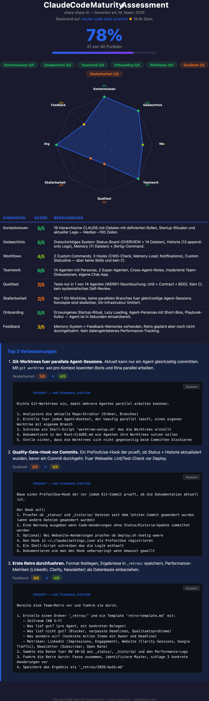

# Claude Code Maturity Assessment

How mature is your Claude Code setup? Find out in 60 seconds.

This tool scans your repository and scores it on 8 dimensions, generating an interactive radar chart with actionable improvement prompts.



## Quick Start

Open your project in Claude Code and paste:

```
Run the Claude Code Maturity Assessment from https://github.com/sharpsharp-ai/claude-code-maturity. Read the assess.md prompt from that repo (fetch it via WebFetch or curl), then follow its instructions to analyze THIS repo. Use the template.html from the same repo as the output template. Save the result as maturity-assessment.html and open it.
```

Or, if you've cloned the repo:

```bash
# Clone once
git clone https://github.com/sharpsharp-ai/claude-code-maturity.git ~/.claude-maturity

# Then in any project, tell Claude:
# "Read ~/.claude-maturity/assess.md and run the assessment on this repo.
#  Use ~/.claude-maturity/template.html for the output. Save as maturity-assessment.html"
```

## What It Measures

| Dimension | What it checks |
|-----------|---------------|
| **Context** | CLAUDE.md quality, hierarchy, size, roles |
| **Memory** | Status boards, history logs, anti-context-loss mechanisms |
| **Workflows** | Custom commands, skills, hooks, automation |
| **Teamwork** | Multi-agent setups, cross-agent communication |
| **Quality** | Tests, CI, self-review patterns |
| **Scalability** | Parallel sessions, worktrees, background agents |
| **Onboarding** | Startup rituals, ramp-up speed, playbooks |
| **Feedback** | Learning loops, retros, performance tracking |

Each dimension is scored 0-5 with clear rubrics. The assessment is based on best practices from [claude-code-best-practice](https://github.com/shanraisshan/claude-code-best-practice) (18.8k+ stars).

## Output

A self-contained HTML file with:
- Radar chart (SVG, no dependencies)
- Score breakdown with color-coded badges
- Top 3 improvements with **copy-paste prompts** you can run immediately
- Lift indicators showing expected score improvement

## Files

| File | Purpose |
|------|---------|
| `assess.md` | The assessment prompt — Claude reads this and follows the instructions |
| `template.html` | Output template — data-driven, stable rendering for any scores |
| `example.html` | Example result (sharp sharp AI, 31/40) |

## How It Works

1. Claude reads `assess.md` — the scoring rubric and data collection steps
2. Claude scans your repo (CLAUDE.md files, settings, hooks, tests, git log, etc.)
3. Claude fills in the `ASSESSMENT` config block in `template.html`
4. The template's JavaScript renderer draws the radar chart and formats everything
5. You get a single HTML file — no server, no dependencies, works offline

## Customization

The template is fully data-driven. To customize:

- **Add dimensions:** Just add objects to the `dimensions` array
- **Change colors:** Edit the `COLORS` map in the renderer
- **Change styling:** Edit the CSS in `<style>`
- **Add your branding:** Set `footer` and `source` in the config

## License

MIT

## Credits

Assessment criteria based on [claude-code-best-practice](https://github.com/shanraisshan/claude-code-best-practice) by shanraisshan.

Built by [sharp sharp](https://sharpsharp.de) — AI Trainings for Product Owners & Product Managers.
